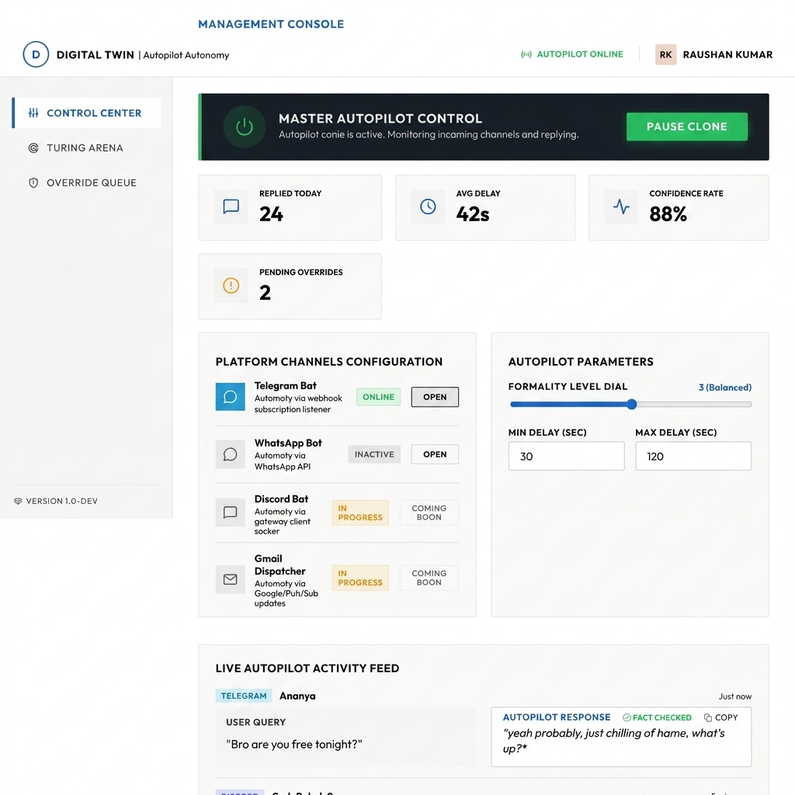
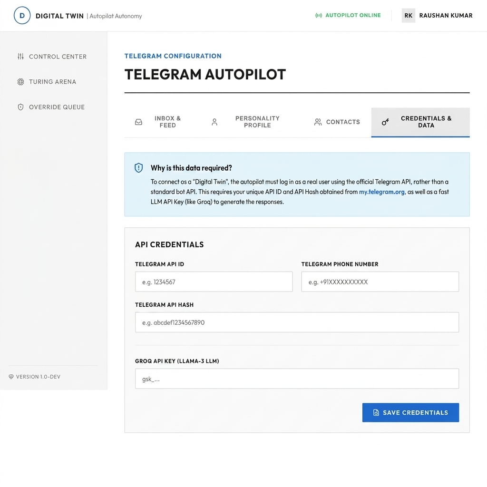

# Digital Twin Autopilot 🚀

**Digital Twin Autopilot** is a personal AI clone that integrates with popular communication platforms (Telegram, Discord, Gmail) to automatically reply to messages on your behalf. The system mimics your voice texture, casual slang, catchphrases, and typing patterns by utilizing a hybrid orchestration of LLMs, local slang engines, and personality configuration dials.

Designed with a premium, corporate **BMW-inspired design system** (clean cream canvas background, corporate blue CTAs, sharp layout grids, and dark navy elevated displays), it provides a complete control center to monitor and audit your digital clone.

---

## 📸 Screenshots

### 1. Management Console (Dashboard)
The dashboard provides a central control panel to override the clone, monitor response stats, configure delays, and view a live conversation feed.


### 2. Telegram Autopilot Credentials & Configuration
Allows you to safely enter your API credentials, phone number, and Groq LLM API Key to connect the client.


---

## 🏗️ Architecture

```
                       ┌────────────────────────┐
                       │  Frontend (React+Vite) │
                       │    (Port 5173 / UI)    │
                       └───────────┬────────────┘
                                   │ (REST API)
                                   ▼
                       ┌────────────────────────┐
                       │  Backend API (FastAPI) │
                       │    (Port 8000 / API)   │
                       └───────────┬────────────┘
                                   │
             ┌─────────────────────┴─────────────────────┐
             ▼ (Reads/Writes State)                      ▼ (Analyzes/Generates)
  ┌──────────────────────┐                     ┌──────────────────────┐
  │ Local JSON Databases │                     │ Slang Engine (Groq)  │
  │ (configs/logs/state) │                     │ & Llama-3 Autopilot  │
  └──────────────────────┘                     └──────────────────────┘
             ▲                                           ▲
             │ (Validates/Controls)                      │ (Triggers replies)
             └─────────────────────┬─────────────────────┘
                                   │
                       ┌────────────────────────┐
                       │ Telegram Client Daemon │
                       │   (Telethon Client)    │
                       └────────────────────────┘
```

The system is split into three main parts:
1. **Frontend (Vite + React 18)**: A single-page dashboard designed with a BMW-inspired corporate color palette (cream canvas, corporate blue, navy panels). It talks to the backend via REST endpoints.
2. **Backend API (FastAPI)**: Manages and exposes configuration toggles, reads/writes autopilot states, and handles activity logs.
3. **Autopilot Daemon (Telethon)**: A persistent background client that listens directly to your incoming Telegram messages, evaluates relationship scores, checks for slangs using a custom matching engine, routes queries to the Groq Llama-3 model, and automatically responds on your behalf.

---

## 🛠️ Installation & Setup

### Prerequisites
* **Node.js (v18+)** & NPM
* **Python (3.10+)**
* *(Optional)* Docker & Docker Compose

### Step 1: Clone and Set up Environment Variables
1. Clone the repository and navigate to the project directory:
   ```bash
   cd runtimerebels
   ```
2. Duplicate `.env.example` to create your local `.env` file:
   ```bash
   cp .env.example .env
   ```
3. Open `.env` and fill in your keys:
   * **`GROQ_API_KEY`**: Obtain from [console.groq.com](https://console.groq.com/).
   * **`API_ID` & `API_HASH`**: Obtain from [my.telegram.org](https://my.telegram.org/).
   * **`PHONE_NUMBER`**: The phone number connected to your Telegram account (e.g., `+1234567890`).

---

### Step 2: Native Manual Installation (Recommended for Local Dev)

#### A. Backend Setup
1. Move to the `backend/` folder:
   ```bash
   cd backend
   ```
2. Create and activate a Python virtual environment:
   * **PowerShell**:
     ```powershell
     python -m venv venv
     .\venv\Scripts\Activate.ps1
     ```
   * **Command Prompt (CMD) / Git Bash**:
     ```bash
     python -m venv venv
     source venv/Scripts/activate
     ```
3. Install the dependencies:
   ```bash
   pip install -r requirements.txt
   ```
4. Start the **FastAPI Server** (Terminal 1):
   ```bash
   uvicorn app.main_api:app --reload --port 8000
   ```
5. Start the **Telegram Listener Daemon** (Terminal 2):
   ```bash
   python app/main.py
   ```
   *(Note: On the first run, the daemon will ask you to enter the login code sent to your Telegram app to authenticate and generate `session.session`.)*

#### B. Frontend Setup
1. Open a new terminal (Terminal 3) and move to the `frontend/` folder:
   ```bash
   cd frontend
   ```
2. Install Node packages:
   ```bash
   npm install
   ```
3. Start the Vite React development server:
   ```bash
   npm run dev
   ```
4. Open **`http://localhost:5173`** in your browser.

---

## 🔌 API Endpoints Reference

### Dashboard REST APIs
| Method | Endpoint | Description |
| :--- | :--- | :--- |
| `GET` | `/api/stats` | Fetches system stats (autopilot status, reply count, avg delay, active platforms). |
| `POST` | `/api/toggle` | Master Kill Switch to globally activate or pause the autopilot. |
| `POST` | `/api/platforms/{platform}/toggle` | Toggle individual channel states (e.g. Telegram). |
| `GET` | `/api/contacts` | Fetches synced contacts list and whitelist/blacklist configuration. |
| `POST` | `/api/contacts/whitelist` | Enables/disables autopilot replies for a specific contact. |

---

## 🎮 Demo
To test your clone locally:
1. Open the UI at `http://localhost:5173`.
2. Go to the **Control Center** dashboard and verify that **Autopilot Status** is showing as **"ONLINE"**.
3. Toggle the Telegram channel to **Online**.
4. Send a private Telegram message to yourself or have a whitelisted contact send you a message.
5. The terminal running `python app/main.py` will print the incoming message, execute the slang engine, and stream/respond using your digital twin clone.
6. The updated reply and activity statistics will immediately appear on the **Live Activity Feed** on the dashboard.

---

## 🔮 Future Improvements
* 🔄 **Database Integration**: Migrate local JSON state engines (`autopilot_state.json`, `activity_log.json`) to SQLite/PostgreSQL for production reliability.
* 🎙️ **Voice Replication**: Support sending audio/voice note responses using ElevenLabs cloning.
* 🤖 **Multi-Channel Integrations**: Full active client daemons for Discord and Gmail (currently under progress).
* 📈 **Advanced Analytics**: Interactive charts showing response time distributions, sentiment matching levels, and memory usage.

---

## 📄 License
This project is licensed under the **MIT License**. Feel free to use, modify, and distribute it.